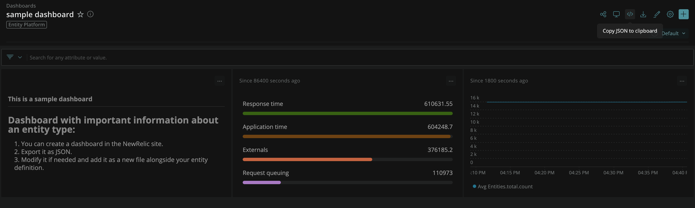

[](https://opensource.newrelic.com/oss-category/#new-relic-experimental)

# Entity Synthesis Definitions 

The definition files contained in this repository are mappings between the telemetry attributes NewRelic ingests, and the entities users can interact with. If you have telemetry from any source that is not supported out of the box, you can propose a mapping for it and upon a successful merge of your PR, any telemetry received by NewRelic and that matches your definition file will be synthesized into an entity. Then you can start leveraging any of the tools built around them such as the entity explorer, high-density views, workloads, etc.

## Guidelines 

Please verify that the definition you want to merge meets the acceptance criteria outlined below 
and if this is your first time creating a definition file please get in contact with the team by opening an issue. 
We can clear any doubts you might have and provide guidance about the best way to proceed, 
so your PR will get merged faster, and you can start enjoying your shiny new entities. 


### Acceptance criteria for new entity definitions

- Each entity definition file must live inside its own folder and both must follow the filename format explained below. 
- The definition MUST be a valid YAML file.
- The definition must contain at least the top-level fields `domain` and `type`, along with the fields `name`, `identifier` and `conditions`, located under `synthesis`. 
The synthesis section is optional only if you can ensure that the telemetry is being stamped with the entity GUID and tags based on rules defined internally at NewRelic.
- We use the `domain`, `type` and `identifier` to assign each entity a Global Unique Identifier (GUID).
- The `domain` must be a value matching `/[A-Z][A-Z0-9_]{2,14}/`. This field is mostly relevant internally for NR. 
Use EXT by default, although we may advise to use a different value in some cases.                
- The `type` must be a value matching `/[A-Z][A-Z0-9_]{2,49}/`. This field is meant to identify the type of entity. 
Some examples are APPLICATION, HOST or CONTAINER.  
- The `identifier` must be assigned a parameter that is unique within the domain and type (e.g
. cluster ID, host ID, etc). Keep in mind that the value has the following restrictions and that the
 entity will not be synthesized if the value extracted from the metrics is considered invalid:
  - `/[\x20-\x7E]{1,50}/`.
  - 1 to 36 standard ascii characters, excluding control chars (codes: 32-126).
  - If you suspect that your identifiers may not fulfil our length requirements, set the optional `encodeIdentifierInGUID` field to true. 
- You must also define a condition to match on the value of an attribute. An entity will be synthesized if it matches the provided condition and contains the attributes set for the identifier and name. 
  For more information on our supported conditions please refer to the [conditions](#conditions) section. 
- The definition needs to provide enough information to differentiate this entity from others. It cannot be a subset nor a superset of any existing definition. 
- If you are creating a definition for a `domain` and `type` that already exists we'll need to
 understand your use case, so please provide an explanation in your PR or get in touch with us to discuss it. 
- If you are adding composite metrics' files for an entity definition they must be placed inside the same folder and follow the filename format.

### Filename format

Each entity definition needs to be placed inside a folder named like this:

`<DOMAIN>-<TYPE>` for example: `infra-etcd_cluster `

Inside each folder there must be *at least* an entity definition file named `definition.yml`.

Composite metrics must be defined in their own YAML file and referenced from the entity definition file. 
They must be placed inside the same folder as the entity definition and must be named according to their type:

- Golden metrics: `golden_metrics.yml`
- Summary metrics: `summary_metrics.yml `

### Schema definition

When creating a new entity definition you may use the following files as a guide:

- Entity definition: [entity definition example](./docs/example-entity-definition.yml)
- Golden metrics definition: [golden metrics definition example](./docs/example-entity-golden_metrics.yml)
- Summary metrics definition: [summary metrics definition example](./docs/example-entity-summary_metrics.yml)

For more concrete examples, you can take a look at the files located on the [definitions](./definitions) folder. 

#### Synthesis

The `synthesis` section of a definition file contains information about the telemetry attributes needed to uniquely identify an entity and synthezise its tags. Some entities, such as those under the `INFRA` domain, don't have this section since they follow rules defined internally at NewRelic for historical reasons. 

If your telemetry has a single set of consistent attributes that can uniquely identify an entity, you can use this synthesis section format:

<details>
  <summary>Example of `synthesis` section with simple format</summary>
  
  ```
  synthesis:
    # [mandatory] The name of a telemetry attribute that will be used as the id of the entity, so it needs to be unique within an account. It can be the same field used for the name or not.
    identifier: attributeNameA
    # [mandatory] The name of a telemetry attribute that will be used as the name of the entity (i.e. k8s.cluster.name).
    name: attributeNameA
    # [mandatory] Condition that must be met for this entity to be synthesized. Only one can be provided. 
    conditions:
      # The attribute’s value must match the provided value
      - attribute: attributeName
        value: value
    # When the value of the identifier attribute is expected to be longer than our maximum allowed characters, you should set this to true. Defaults to false.
    encodeIdentifierInGUID: false
    # Telemetry attributes that should be extracted into entity tags.
    tags:
      attributeNameB:
      attributeNameC:
  ```
</details>


If your telemetry has different sources which don't send the same attributes, you might need to define a specific set of rules for each one of them. In this case you cannot use the simplified synthesis format, instead, you must provide each set of rules inside a `rules` section:

<details>
  <summary>Example of `synthesis` section with multi-rule format</summary>
  
```
synthesis:
  rules:
    # [mandatory] The name of a telemetry attribute that will be used as the id of the entity, so it needs to be unique within an account. It can be the same field used for the name or not.
    - identifier: attributeNameA
      # [mandatory] The name of a telemetry attribute that will be used as the name of the entity (i.e. k8s.cluster.name).
      name: attributeNameA
      # [mandatory] Condition that must be met for this entity to be synthesized. We need exactly one condition per synthesis rule. 
      conditions:
      # The attribute’s value must match the provided value
      - attribute: attributeName
        value: value
      # When the value of the identifier attribute is expected to be longer than our maximum allowed characters, you should set this to true. Defaults to false.
      encodeIdentifierInGUID: false
      # Telemetry attributes that should be extracted into entity tags. Specific to this synthesis rule. 
      tags:
        attributeNameB:
    - identifier: attributeNameC
      name: attributeNameC
      conditions:
      - attribute: attributeName
        value: value
      encodeIdentifierInGUID: false
      tags:
        attributeNameD:
  # Telemetry attributes that should be extracted into entity tags, regardless of the synthesis rule used. 
  tags:
    attributeNameE:
```
</details>

As you can see, you can (optionally) define tags inside and outside of the `rules` section. Tags that are defined outside of `rules` will be common to this entity type, regardless of the synthesis rule used.  

##### Conditions

We support the following conditions over telemetry attributes and their values:

- Attribute match: If the specified attribute is present on the telemetry, synthesize the entity. The value of the attribute is not taken into account. 

```yaml
  conditions:
    # The attribute must be present on the telemetry
    - attribute: attributeName
```
- Value match: If the value of the specified telemetry attribute matches the expected one, synthesize the entity.

```yaml
  conditions:
    # The attribute’s value must match the provided value
    - attribute: attributeName
      value: value
```
- Value prefix match: If the value of the specified telemetry attribute has the expected prefix, synthesize the entity.

```yaml
  conditions:
    # The attribute’s value must have the expected prefix
    - attribute: attributeName
      prefix: val
```

##### Tags

When synthesizing an entity we add some tags to it by default based on telemetry attributes and others based on the entity synthesis rules.

###### Default tags

We convert any telemetry attribute prefixed with `tags.` into an entity tag (e.g. `tags.clusterName` becomes a tag `clusterName`). 
If the telemetry contains an `instrumentation.provider` attribute we also create an entity tag from it with the same name and value.  

If a rule-defined tag and a default tag result in the same entity tag name, the value of the default tag will be used. 
This means for example that you can't override the value of `instrumentation.provider` if the attribute comes in the telemetry. 

In either case the resulting entity tag name can't be one of our reserved tags:
- name
- guid
- account
- accountId
- trustedAccountId

###### Rule-defined tags

The `tags` field accepts a map of metric attributes to entity tag configurations that can be used to generate tags for the entities of the defined DOMAIN and TYPE.
During synthesis, the tags will be created using the attribute name as key and its value as the tag value. The tag configurations are optional and can be left empty. 

If some of the tags' attributes are not present on the telemetry message received, the entity will still be synthesized with the available tags (if any).

By default, an entity tag will contain all the values seen for this attribute in the telemetry.
If you want to override all the values with the new one you can configure `multiValue: false` for that specific tag.

```yaml
  tags:
    attributeNameB:
      multiValue: false
    attributeNameC:
```

An example of this is `INFRA-CONTAINER` where the tag `container.state` will always display the last state (`running`, `stopped`, etc) instead of a list of all the states the entity has gone through.

You can also configure the tag name that you want for the entity tags we synthesize. By default, the entity tag names are equal to the telemetry attributes you specify on the `tags` section, but you can specify a different tag name using the `entityTagName` field.  

In the example below if `attributeNameB` is present on the telemetry, a tag with key `preferredTagName` and the value of the attribute will be added to the entity. For `attributeNameC` a tag would be created with `attributeNameC` as the key. 

```yaml
  tags:
    attributeNameB:
      entityTagName: preferredTagName
    attributeNameC:
```

This explicit naming can be used to guarantee consistency when you have telemetry from different sources for a single entity, since they are likely to use different attribute names for what would conceptually be the same entity tag. Otherwise, our advice is to use the default naming.

An example of an entity definition where the `entityTagName` is needed and correctly used is the [INFRA-CONTAINER](https://github.com/newrelic-experimental/entity-synthesis-definitions/blob/main/definitions/infra-container/definition.yml) type. 

#### Golden tags

The `goldenTags` field accepts an array of tag-keys which are considered the most important for the entity's DOMAIN and TYPE, 
so that they can be highlighted in the different NewRelic visualizations as important metadata for the entity. 

The `goldenTags` may be a subset of those defined in the `tags` field, but they can also be added to the entity after synthesis, 
so we trust the criteria of the contributor of the definition to select the tags they need as the domain expert. 

#### Composite metrics

Composite metrics are those deemed important by you and used by NewRelic to provide an out-of-the-box experience with your entities. There are two types of composite metrics that can be defined:

- Summary metrics: Data related to entities that describes how certain parameters are behaving based on the available telemetry. Some examples of good summary metrics are an aggregated form of Throughput, CPU usage and Memory usage to be shown in, for example, a Table. See the [summary metrics](docs/summary_metrics.md) documentation to know more.  
- Golden metrics: These are metrics that are deemed the most important for the given entity and are used, for example, in its 'overview' page. See the [golden metrics](docs/golden_metrics.md) documentation to know more.  

#### Dashboard templates

You can create a dashboard with the NewRelic interface and export it to JSON format:



Then you can just copy it to a file within your entity type's folder, modify it as needed and sanitize it using the Dockerized dashboard sanitizer that we provide: 

```
docker-compose run sanitize-dashboards
``` 

You must also link your dashboard with the entity definition by adding it to the definition.yml:

```yaml
dashboardTemplates:
 newRelic:
  template: dashboard.json
```

If your entity has more than one telemetry source you can also provide a different dashboard for each of them. The entity must have the tag `instrumentation.provider` with the value used as the key of the `dashboardTemplates`. If you are using a NewRelic agent you should use `newRelic` as the tag value, otherwise come talk to us and we'll guide you. 

In the example below we define a dashboard for two telemetry sources `newRelic` and `otherSource`. 
If no tag matches the keys you provide in the map, the dashboard used will be the first one defined, in this case the one for `newRelic`. 


```yaml
dashboardTemplates:
 newRelic:
  template: dashboard.json
 otherSource:
  template: other_source_dashboard.json
```


#### Configurations

In the `configuration` section of the `definition.yml` file you can tweak the entity's behavior. 
At the moment we accept two optional configuration parameters `entityExpirationTime` and `alertable`.

```yaml
configuration:
  # The amount of time without receiving telemetry before an entity is deleted. Defaults to EIGHT_DAYS
  entityExpirationTime: EIGHT_DAYS
  # Defines whether the entities of this type should have an alert severity associated, defaults to true
  alertable: true
```

**entityExpirationTime**

By default, entities are automatically deleted if we reach 8 days without receiving any telemetry from them. 
If this doesn't suit your needs you may set the `entityExpirationTime` to one of the following values:  

- `FOUR_HOURS`
- `DAILY`
- `EIGHT_DAYS` (default)
- `QUARTERLY`
- `MANUAL` (allowed only for entities without a `synthesis` section)


**alertable**

If `alertable` is set to true (default), the entity's metadata will include a field `alertSeverity` that is updated when the telemetry associated to this entity breaks an alerting condition.


## Testing and validation

Some validations are automatically executed whenever there is a contribution via pull request, to verify that the provided definition meets the basic requirements:

* The definition files are not malformed, incorrect or missing mandatory fields. 
* The *identifier* cannot be extracted from an attribute with the same name for two different Domain-Types, unless conditions are set to differentiate them, so that the conditions from one entity are not a superset of the other. 

You can execute the validations locally using our dockerized validator:

```
docker-compose run validate-definitions
``` 

You can read more about the current validations [here](/validator/README.md).

## Support

If the information provided in the repository is not enough to solve your doubts, you can get in contact with the team by opening an issue. 

**Other Support Channels**

* [New Relic Documentation](https://docs.newrelic.com): Comprehensive guidance for using our platform
* [New Relic Community](https://discuss.newrelic.com): The best place to engage in troubleshooting questions
* [New Relic Developer](https://developer.newrelic.com/): Resources for building a custom observability applications
* [New Relic University](https://learn.newrelic.com/): A range of online training for New Relic users of every level
* [New Relic Technical Support](https://support.newrelic.com/) 24/7/365 ticketed support. Read more about our [Technical Support Offerings](https://docs.newrelic.com/docs/licenses/license-information/general-usage-licenses/support-plan).

## Contributing
We encourage you to add new entity types! Keep in mind when you submit your pull request, you'll need to sign the CLA via the click-through using CLA-Assistant. You only have to sign the CLA one time per project.
If you have any questions, or to execute our corporate CLA, required if your contribution is on behalf of a company,  please drop us an email at opensource@newrelic.com.

**A note about vulnerabilities**

As noted in our [security policy](../../security/policy), New Relic is committed to the privacy and security of our customers and their data. We believe that providing coordinated disclosure by security researchers and engaging with the security community are important means to achieve our security goals.

If you believe you have found a security vulnerability in this project or any of New Relic's products or websites, we welcome and greatly appreciate you reporting it to New Relic through [HackerOne](https://hackerone.com/newrelic)

## License
Entity Synthesis Definitions is licensed under the [Apache 2.0](http://apache.org/licenses/LICENSE-2.0.txt) License.
