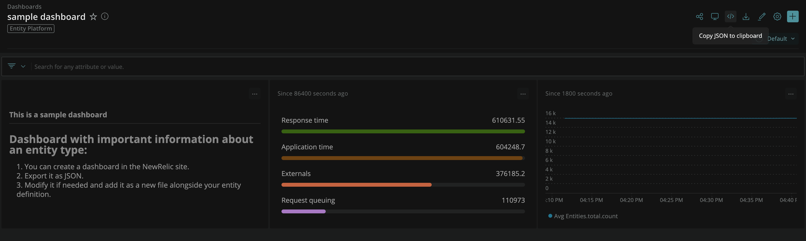

# Entity Summary

The entity summary is the entity's main page, and contains all the information about a specific entity:

* Dashboards should be listed in the `definition.yml` file, under the `dashboardTemplates` section.
* If the entity type only has one source of data, use `newRelic` as the default source.
* By default, each NRQL query will be filtered by the entity GUID. If you want to disable this behavior, set `filterNRQLByEntityID` to `false`. When you disable this behavior, you must manually specify the filter for all NRQL queries in the dashboard. See [Filtering by Entity GUID](#filtering-by-entity-guid) for more details.

```yaml
dashboardTemplates:
  newRelic:
    template: dashboard.json
    filterNRQLByEntityID: true
```

In order to get a dashboard in JSON format, [create a dashboard](https://docs.newrelic.com/docs/query-your-data/explore-query-data/dashboards/introduction-dashboards/) in New Relic and [export it as json](https://docs.newrelic.com/docs/query-your-data/explore-query-data/dashboards/dashboards-charts-import-export-data/#dashboards).



Copy the JSON content to the `dashboard.json` file.

Make sure your dashboard is valid running our sanitizer:

`docker-compose run sanitize-dashboards`

You can also run it with npm:

`cd validator && npm i && npm run sanitize-dashboards`

## Multiple sources of data

In some cases your entity will receive metrics from different sources. We provide a different summary page representation for each one of them.

In this example, the entity must have `prometheus` and `newRelic` in the `instrumentation.provider` tag. The first tag value that matches the entity will serve the summary page:

```yaml
dashboardTemplates:
  newRelic:
    template: newRelic_dashboard.json
  prometheus:
    template: prometheus_dashboard.json
```

We recommend prefixing dashboard names with the source name.

You can also specify both provider and name in the form of `{provider}/{name}`.

1.  Add the provider as a value of the `instrumentation.provider` tag. For example, provider: `kentik`.
2.  Add the name of the provider in the `instrumentation.name` tag. For example, provider name: `netflow-events`.

Note that query semantics (such as average vs counts, units, etc.) should match in each implementation. If no rule matches, the first one on the list will be used. In the example above, `prometheus` would be used.

```yaml
dashboardTemplates:
  kentik/netflow-events:
    template: kentik_netflow-evens_dashboard.json
```

## Filtering by Entity GUID
```yaml
dashboardTemplates:
  newRelic:
    template: dashboard.json
    filterNRQLByEntityID: true
```

By default the NRQL query will be filtered by the entity GUID. If you want to disable this behavior, set `filterNRQLByEntityID` to `false`. When you disable this
behavior, you must manually specify the filter for all NRQL queries in the dashboard. You can use mustache syntax to reference [available variables](#available-variables).

For example, if you want to filter by the entity GUID, you can use the following NRQL query:
```sql
FROM Metric SELECT latest(k8s.clusterName) as 'Cluster Name' WHERE metricName = 'k8s.pod.startTime' AND `entity.guid` = '{{entity.id}}'
```

### Available variables
| Variable | Description |
| --- | --- |
| `entity.id` | The entity GUID |
| `tags.*` | Any tag value, see below for more details on how to find the tag name |

### Finding the tag name
Tags are assigned to all entities based on the tags defined in an entity's definition file. For example, the `ext-pixie_postgres` entity type defines
`k8s.cluster.name` as a tag.
https://github.com/newrelic/entity-definitions/blob/42b7a5a1780d897312f231aac3271898f8c87ff5/definitions/ext-pixie_postgres/definition.yml#L34-L35

In a NRQL query, you can reference the value of a tag using `tags.k8s.cluster.name` like so:
```sql
FROM Metric SELECT latest(k8s.clusterName) as 'Cluster Name' WHERE k8s.cluster.name = '{{tags.k8s.cluster.name}}'
```
