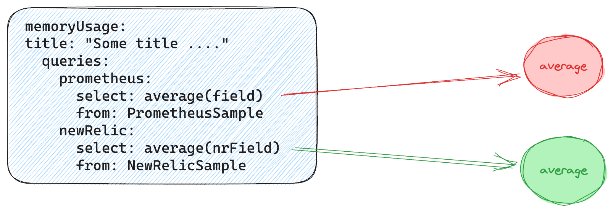
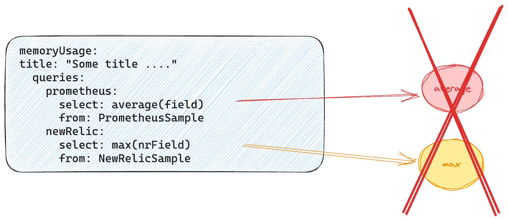
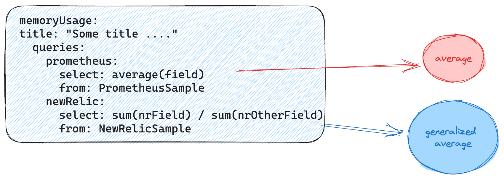

# Golden Metrics

Golden metrics are the most important metrics for a specific entity type.

We allow a maximum of 10 metrics, although we recommend no more than 3.

## Defining golden metrics

Golden metrics should be defined under the file name `golden_metrics.yml`.

They're defined in a map with a unique key, which defines the intention of the metric:

* We allow the `[a-zA-Z0-9_]` characters, with a maximum of 100 characters.
* Provide a `title`, with a brief explanation of the query.
* Provide a `unit`, which helps the UI make unit conversions when required.

For example, a query result of `0.003 seconds` will most probably be converted into `3 miliseconds`.

```yaml
memoryUsage:
  title: "A title explaining what the user is seeing"
  unit: COUNT
  queries:
    newRelic:
      select: average(host.memoryUsagePercent)
      from: Metric
      where: ""
      facet: ""
      eventId: entity.guid
      eventName: entity.name
  displayAsValue: false
```

All the fields, except `title`, `unit` and `query.select`, are optional.

The previous example shows the default values for each configuration option, so it's equivalent to this:

```yaml
memoryUsage:
  title: "A title explaining what the user is seeing"
  unit: COUNT
  queries:
    newRelic:
      select: average(host.memoryUsagePercent)
```

### Metric options

| **Name** | **Mandatory** | **Default** | **Description**                                            |
| -------- | ------------- | ------------ | ---------------------------------------------             |
| title    |      Yes      |  | Provide a meaningful title to the graph or value you are displaying.|
| displayAsValue |   No    | `false` | Use this option if you want to display a value instead of a line of data (`TIMESERIES`) when viewing the information of **one** entity. |
| unit     | [Metric Unit](#metric-unit) |   | The unit of the metric, used to provide more context to the user. |
| queries  | Yes | | A map of queries where the key is the provider.|

### Query options

When multiple sources of data exist, provide a query for each source. Otherwise use `newRelic` as the key.

| **Name** | **Mandatory** | **Default** | **Description**                                            |
| -------- | ------------- | ------------ | ---------------------------------------------             |
| select    |      Yes      |  | Provide the field and function you want to display in the metric. You must only provide one field, but you can do aggregations, sums, etc. Always name the fields to make it easier to read: for example, `sum((provider.httpCodeElb4XXCount.Sum OR 0) + (provider.httpCodeElb5XXCount.Sum OR 0)) AS 'Errors'`|
| from |   No    | `Metric` | Choose where your metric gathers the information from. |
| where |   No    | empty string | In the event you need a more granular `WHERE` clause added to the query, use this field. For example, `provider='Alb'`. |
| facet |   No    | empty string | An extra facet by a specific field to be added to the default facet by `entityName`. |
| eventId |   No    | `entity.guid` | The event attribute used to filter the entity. We recommend to use the default `entity.guid`, which is generated automatically as part of the entity synthesis. |
| eventName |   No    | `entity.name` | The name of the field in the event that references the entity name. By default, `entity.name`, which is generated automatically as part of the entity synthesis. |

### Metric Unit

The unit of the metric must be a string with one of the following values:

- REQUESTS_PER_SECOND
- REQUESTS_PER_MINUTE
- PAGES_PER_SECOND
- MESSAGES_PER_SECOND
- OPERATIONS_PER_SECOND
- COUNT
- SECONDS
- MS
- PERCENTAGE
- BITS
- BYTES
- BITS_PER_SECOND
- BYTES_PER_SECOND
- HERTZ
- APDEX
- TIMESTAMP
- CELSIUS

### Multiple sources of data

When the entity type can be ingested from multiple sources, you'll be required to provide a different query implementation for each source.

In this example, the entity must have `prometheus` and `newRelic` in the `instrumentation.provider` tag. The first tag value that matches the entity will be used to build the queries.

```yaml
memoryUsage:
  title: "A title explaining what the user is seeing (unit displayed in the dashboard)"
  queries:
    prometheus:
      select: average(field)
      from: PrometheusSample
    newRelic:
      select: average(nrField)
      from: NewRelicSample
```

There's also the possibility to specify both provider and name in the form of `{provider}/{name}`.

1.  Add the provider as a value of the `instrumentation.provider` tag. For example, provider: `kentik`.
2.  Add the name of the provider in the `instrumentation.name` tag. For example, provider name: `netflow-events`.

Note that query semantics (such as average vs counts, units, etc.) should match in each implementation. If no rule matches, the first one on the list will be used. In the example above, `prometheus` would be used.

```yaml
destinations:
  title: Unique Destinations
  queries:
    kentik/netflow-events:
      select: uniqueCount(dst_addr)
      from: KFlow
      where: "provider = 'kentik-flow-device'"
```

Last but not least, there's also a very important concept that needs to be considered - each query implementation from each source **must be of same metric kind**, otherwise, _**the platform will simply reject it**_. In an attempt to make it simple and clear, you can think of a metric kind as something that's inferred from each query definition that tells the platform how to really interpret the values from the source stream so that, when the time comes to combine many sources, the platform has a very valuable hint on how to synteshize each stream in a way to "fit all of them into the same golden-metric vessel". The metric kind is the type of vessel. 

i.e. let's start simple and explore the example above:



This definition is valid since both query implementations are expressing an **AVERAGE** metric kind seeing as, well, they both rely on the **average** function. Given that both expressions are of the same kind, there won't hard to fit all streams into the shape of an **average**, so it will be considered as valid.

Now let's move on to a different example, this time we'll keep **average** function on one definition but, given the nature of the provider instrumentation, you need to use **max** on the second one, something like this:



The problem with this particular definition is that there's no way to fit both *average* and *max* in a "single vessel" due to the fact that they both have different semantics (How would you query an *average* and a *max* using just a single expression so that they are both part of the same metric? Ruminate that for a minute). For this particular case, given that both expressions are of different kinds, the definition will end up being rejected since there's no way to represent that as a single timeseries. But what if we need to calculate an average by dividing two different aggregates then? Does it mean it's not going to work? Something like this:



Luckily, the engine is "smart enough" to infer if there's a kind that could accurately represent the expressed value. It should be noted that *it doesn't come without fail* and it's more about a best-effort solution, still, it is a powerful enough feature that allows building slighltly more complex expressions. For this particular example, even if `SUM(a)/SUM(b)` is used and a metric kind of **SUM** could seem like right kind (both parts are using the *sum* function), since both sums are divided as well, the engine will also see an **average** of **sums**, and that's why it will be inferred as **GENERALIZED_AVERAGE**, and since this type is compatible with **AVERAGE**, the overall definition would still be seen **AVERAGE** kind.

In case you're curious, here's a list of supported metric kinds:

- COUNT
- SUM
- MIN
- MAX
- AVERAGE
- GENERALIZED AVERAGE
- CONSTANT
- PERCENTILE
- BUCKET PERCENTILE
- LATEST
- UNIQUE COUNT
- 

### Currently supported NRQL expressions

Telemetry for Golden Metrics is evaluated while it is streaming through our ingest pipeline (*before it is written to disk in NRDB*). As such, it is not possible to support ever NRQL expression. The following is a breakdown of the expressions currently supported in creating queries for Golden Metrics:

| <div style="width:380px">**Expression**</div> | **Notes** |
|----------------|-----------|
| `sum(x)`<br />`min(x)`<br />`max(x)`<br />`average(x)`<br />`count(x)` | Basic `operation`s on a value |
| `C * operation(x)`<br />`C / operation(x)` | `constant C != 0` |
| `C * sum(x) / count(y)`<br />`C * count(x) / count(y)`<br />`C * sum(x) / sum(y)`<br />`filter( C * count(x), WHERE ...) / count(x)`<br />`filter(count(x), WHERE ...) * C / count(x)` | Useful to calculate averages or percentages.  *`x` and `y` can be equals.* |
| `op(x) + op(y)`<br />`op(x) OR op(y)` | Only some operations are addable or 'or-able': `sum`, `min`, `max`, `average` |
| `sum(x) - sum(y)` |   |
| `uniqueCount(x[, y...])`<br />`uniqueCount(tuple(x, y, ...))` | There is support for a `tuple` with more than 1 value.  Note: `uniqueCount(x, y) == uniqueCount(tuple(x, y))` |
| `latest(x) ± C` |   |
| `rate(op(x), 1 minute)` |   |
| `(sum(x) ± sum(y)) / sum(z)` |   |
| `percentile(x, 90)` | Although the [percentile](https://docs.newrelic.com/docs/query-your-data/nrql-new-relic-query-language/get-started/nrql-syntax-clauses-functions/#func-percentile) function supports more than one argument, the Golden Metrics pipeline only allows 1 argument. |

#### Further explanation

To provide more context around this concept; take this example:

```
latest(x) + latest(y) + latest(z)
```

This does not make sense in the context of analyzing streaming telemetry for 2 primary reasons:

1. The processing pipeline is distributed. Meaning that a specific metric will almost assuredly be processed by different processors.
2. To keep the pipeline simple, it lacks a central or distributed state. There's no way of maintaining information during a time window just for the sake of processing it by the end of the window.

In order to calculate `latest`, a pipeline should:

1. Keep all the observed datapoints for the different metrics in a central state (it needs state).
2. At the end of a time window, it should aggregate in a common place (not be distributed).
3. Once aggregated, the metric must be synthesized.

Another way to think about this is that a streaming pipeline cannot know the `latest` of anything because it simply does not have any context about any other data point in this manner. Without an `earliest`, there can be no `latest`.
